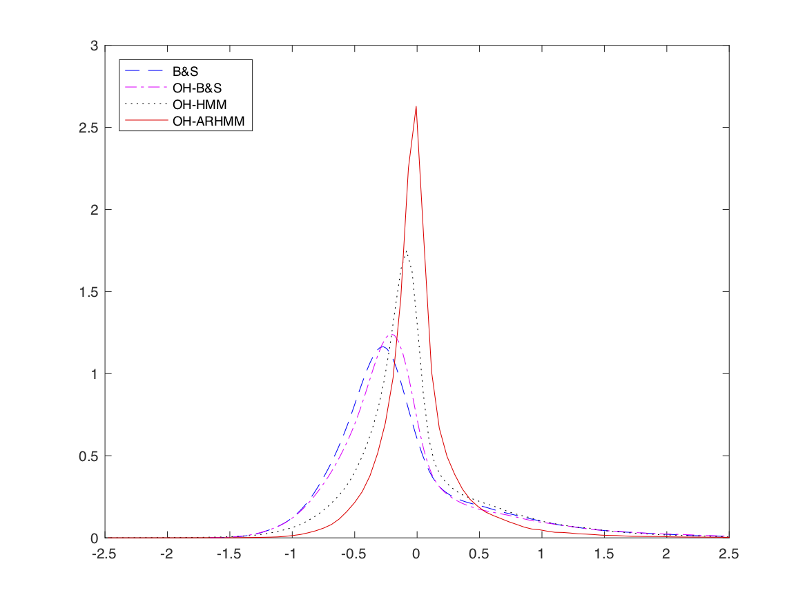

# Codes for "Option Pricing and Hedging for Discrete Time Autoregressive Hidden Markov Model"
https://arxiv.org/abs/1707.02019

## Modeling Asset Returns 

the following models are available for modelisation
* HMM (hidden markov model)
* ARHMM (autoregressive hidden markov model)
* VHMM (multidimentional hidden hidden markov model)
* VARHMM (multidimentional autoregressive hidden hidden markov model)

Est\<model\>.m for calibrating the models <br />
Gof\<model\>.m for Goodness-of-fit test <br />
Sim\<model\>.m for simulation <br />


to simulate some processes, calibrate the different models and run Godness-of-fit test, run:
```
simulate_and_calibrate.m
```

## Optimal Hedging

the following models are available for hedging:
* Delta-Hedging <br /> (HedgingError_DH.m) 
* Optimal Hedging with Gaussian Returns <br /> (HedgingError_Gaussian.m OR HedgingGaussian.m + Hedging_Error_Gaussian_ac.m 
* Optimal Hedging with HMM Returns and Semi-exact approximation <br /> (HedgingError_HMM.m OR HedgingHMM.m + Hedging_Error_HMM_ac.m 
* Optimal Hedging with HMM Returns and Monte Carlo approximation <br /> (HedgingError_HMM_MC.m OR HedgingHMM.m + Hedging_Error_HMM_ac.m 
* Optimal Hedging with ARHMM Returns and Semi-exact approximation <br />(HedgingError_ARHMM.m OR HedgingARHMM.m + Hedging_Error_ARHMM_ac.m 
* Optimal Hedging with ARHMM Returns and Monte Carlo approximation <br /> (HedgingError_ARHMM_MC.m OR HedgingARHMM.m + Hedging_Error_ARHMM_ac.m 


to price an option and hedge it under multiple simulations, run:
```
simulate_and_hedge.m
```

this script will reproduce Figure 8:




